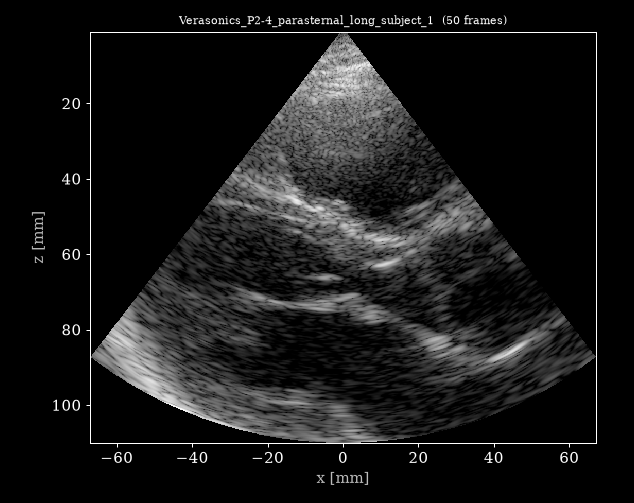

# USTB - In-vivo Cardiac (Verasonics P4-2)



*All 50 frames of [`Verasonics_P2-4_parasternal_long_subject_1.hdf5`](https://huggingface.co/datasets/nvidia/OpenH-RF/blob/main/oslo/A_cardiac/Verasonics_P2-4_parasternal_long_subject_1.hdf5), reconstructed from the raw channel data with `reconstruct.py`.*

## Dataset Description

Part of the **UltraSound ToolBox (USTB) Channel Capture Collection** (see the [collection card](../README.md)).

In-vivo human cardiac channel-capture data acquired with a Verasonics Vantage 256 research scanner and a P4-2 phased-array probe. The collection contains parasternal long-axis and apical four-chamber views recorded with focused transmit beams (sector scan). The data is pre-beamformed RF channel data intended for research into generalized beamforming, adaptive imaging and cardiac reconstruction.

## Dataset Contributor(s)

- Ole Marius Hoel Rindal <omrindal@ifi.uio.no> (primary contact)
- Yucel Karabiyik
- Sven Peter Nasholm
- Andreas Austeng
- University of Oslo (UiO), Department of Informatics

## Dataset Creation Date

06/23/2026 (packaging date; original acquisitions/simulations were produced between 2016 and 2023).

## License / Terms of Use

[Creative Commons Attribution 4.0 International (CC BY 4.0)](https://creativecommons.org/licenses/by/4.0/legalcode.en). Retain attribution and identify modifications when reusing the data.

## Intended Usage

Generalized reconstruction and adaptive beamforming of cardiac ultrasound (RFP task 6.1). Suitable for B-mode reconstruction, aperture-domain processing, and deep-learning beamforming research on in-vivo cardiac data. (OpenH-RF RFP task 6.1 Generalized Reconstruction).

## Dataset Characterization

- **Data Collection Method:** clinical
- **Labeling Method:** N/A (raw channel data; no annotations).
- **Acquisition system:** probe(s) P4-2; element positions stored in `/probe/probe_geometry` (meters); center frequency, sampling frequency and sound speed stored per acquisition in `/scan` (see per-sample feature table).

## Processing the Dataset

The example acquisition can be processed with the `pipeline.yaml` definition in this folder and the [zea library](https://github.com/tue-bmd/zea).

`zea` streams the data from the Hugging Face Hub and processes it according to the pipeline. You can try it out with the following command:

```bash
zea process \
  --dataset hf://nvidia/OpenH-RF/oslo/A_cardiac/Verasonics_P2-4_parasternal_long_subject_1.hdf5 \
  --config hf://nvidia/OpenH-RF/oslo/A_cardiac/pipeline.yaml
```

This `pipeline.yaml` holds the pipeline, display window and sector limits of that acquisition. Alternatively, all acquisitions can be processed with the `reconstruct.py` [script](https://github.com/open-h/OpenH-RF/blob/main/datasets/oslo/reconstruct.py) at the root of this collection, as provided in the [OpenH-RF GitHub repository](https://github.com/open-h/OpenH-RF), together with the `pipeline*.yaml` definitions at the collection root and the [zea library](https://github.com/tue-bmd/zea). The script streams the data from the Hugging Face Hub; `parameters.yaml` picks the pipeline, display window and dynamic range per acquisition (see the [collection card](../README.md#processing-the-dataset)).

## Dataset Format

[zea v0.1.6](https://github.com/tue-bmd/zea)

All acquisitions are stored in the **zea** HDF5 file format. Each `.hdf5` file is a single acquisition with raw channel data `/data/raw_data` of shape `(n_frames, n_tx, n_ax, n_el, n_ch)` and a fully populated `/scan` group describing the transmit sequence (delays, focus distances, steering angles, apodization, timing). Data type: RF (n_ch=1). No demodulation or decimation was applied during packaging beyond conversion from the USTB Ultrasound File Format (UFF) to zea; RF data is demodulated inside the reconstruction pipeline.

## Dataset Quantification

**Current OpenH-RF release:** 2 HDF5 files; 3.53 GB (3,533,897,728 bytes) stored; root `zea_version` **0.1.6**. Sizes include all HDF5 contents and use decimal units (MB = 10^6 bytes, GB = 10^9 bytes, TB = 10^12 bytes), not decoded-array memory or original-source download sizes.

- **Number of acquisitions:** 2
- **Total channel-capture frames:** 75
- **Train / validation / test split:** not predefined (research dataset).
- **Stored HDF5 size:** 3.53 GB (3,533,897,728 bytes).

Per-acquisition summary:

| Acquisition | frames | transmits | samples | elements | n_ch | fs (MHz) | fc (MHz) | size (MB) |
|---|---|---|---|---|---|---|---|---|
| `Verasonics_P2-4_apical_four_chamber_subject_1` | 25 | 101 | 2176 | 64 | 1 | 11.9 | 2.98 | 1181.42 |
| `Verasonics_P2-4_parasternal_long_subject_1` | 50 | 101 | 2176 | 64 | 1 | 11.9 | 2.98 | 2352.48 |

Per-sample feature table:

| Field | Shape | Dtype | Units | Description |
|---|---|---|---|---|
| `data/raw_data` | `(n_frames, n_tx, n_ax, n_el, n_ch)` | float32 | a.u. | Raw pre-beamformed RF channel data |
| `scan/sampling_frequency` | `scalar` | float32 | Hz | A/D sampling frequency |
| `scan/center_frequency` | `scalar` | float32 | Hz | Transmit pulse center frequency |
| `scan/demodulation_frequency` | `scalar` | float32 | Hz | Demodulation (carrier) frequency |
| `scan/sound_speed` | `scalar` | float32 | m/s | Assumed medium speed of sound |
| `scan/initial_times` | `(n_tx,)` | float32 | s | A/D start time per transmit |
| `scan/t0_delays` | `(n_tx, n_el)` | float32 | s | Per-element transmit fire times |
| `scan/tx_apodizations` | `(n_tx, n_el)` | float32 | - | Per-element transmit apodization |
| `scan/focus_distances` | `(n_tx,)` | float32 | m | Focus distance per transmit (0 = plane wave) |
| `scan/polar_angles` | `(n_tx,)` | float32 | rad | Transmit steering (polar) angle |
| `scan/transmit_origins` | `(n_tx, 3)` | float32 | m | Transmit beam origin (x, y, z) |
| `probe/probe_geometry` | `(n_el, 3)` | float32 | m | Element positions (x, y, z) |

## Subject Metadata

Healthy adult volunteer(s). Anatomy: heart (parasternal long-axis, apical four-chamber). Scanner: Verasonics Vantage 256. Probe: P4-2 phased array (64 elements). Aggregate only; no per-subject identifiers are stored.

## Data Validation

A Delay-And-Sum `zea.Pipeline` (`cast -> demodulate -> delay-and-sum beamform -> envelope detect -> normalize -> log compress`; RF is demodulated in-pipeline, IQ uses a baseband pipeline) reconstructs every acquisition as a portable check that the recorded geometry and timing are correct (see *Processing the Dataset*).

The reference B-mode images committed alongside the data (`<name>_bmode.png`) are produced with the UltraSound ToolBox (USTB) MATLAB Delay-And-Sum beamformer — the exact per-dataset reconstruction used in the public USTB dataset catalog (https://unioslo.github.io/USTB/datasets.html), with scanline transmit apodization for focused/sector acquisitions and correct sector-scan geometry. These are the recommended reference reconstructions for visual verification.

## Known Issues

Focused sector acquisition: lateral resolution and field of view follow the transmit geometry. Phased-array data is best reconstructed on a polar (sector) grid. Frame counts vary per acquisition.

## Ethical Considerations

In-vivo data recorded from healthy adult volunteers at the University of Oslo with written informed consent for research use and data sharing, and approval from the Regional Committee for Medical and Health Research Ethics (REK), Norway. The files contain only backscattered RF channel data and acquisition parameters - no patient name, identifier, date of birth, acquisition date, facial image, or any other HHS Safe Harbor identifier is present (de-identified by construction).

## Citation

Please cite the UltraSound ToolBox (USTB) Channel Capture Collection, University of Oslo (Zenodo record 20261898).
