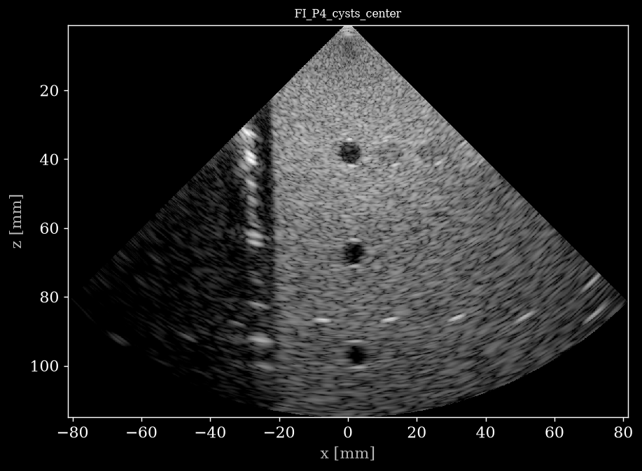

# USTB - Phantom (Verasonics L7-4 / P4)



*First frame of [`FI_P4_cysts_center.hdf5`](https://huggingface.co/datasets/nvidia/OpenH-RF/blob/main/oslo/C_verasonics_phantom/FI_P4_cysts_center.hdf5), reconstructed from the raw channel data with `reconstruct.py`.*

## Dataset Description

Part of the **UltraSound ToolBox (USTB) Channel Capture Collection** (see the [collection card](../README.md)).

Tissue-mimicking and table-top phantom channel-capture data acquired on a Verasonics Vantage 256 with L7-4 linear and P4 phased-array probes. The collection spans coherent plane-wave compounding (CPWC), focused imaging (FI), synthetic transmit aperture (STA) and diverging-wave (DW) sequences for resolution, contrast, dynamic-range and point-spread-function evaluation, including CIRS tissue-mimicking phantom targets.

## Dataset Contributor(s)

- Ole Marius Hoel Rindal <omrindal@ifi.uio.no> (primary contact)
- Yucel Karabiyik
- Sven Peter Nasholm
- Andreas Austeng
- University of Oslo (UiO), Department of Informatics

## Dataset Creation Date

06/23/2026 (packaging date; original acquisitions/simulations were produced between 2016 and 2023).

## License / Terms of Use

[Creative Commons Attribution 4.0 International (CC BY 4.0)](https://creativecommons.org/licenses/by/4.0/legalcode.en). Retain attribution and identify modifications when reusing the data.

## Intended Usage

Generalized reconstruction, image-quality assessment (resolution, contrast, dynamic range), and beamforming research (RFP task 6.1). Several acquisitions provide multiple transmit schemes on the same target for cross-method comparison. (OpenH-RF RFP task 6.1 Generalized Reconstruction).

## Dataset Characterization

- **Data Collection Method:** phantom
- **Labeling Method:** Derived (known phantom geometry, e.g. CIRS Model 040GSE where applicable).
- **Acquisition system:** probe(s) L7-4, P4-1, P4-2; element positions stored in `/probe/probe_geometry` (meters); center frequency, sampling frequency and sound speed stored per acquisition in `/scan` (see per-sample feature table).

## Processing the Dataset

The example acquisition can be processed with the `pipeline.yaml` definition in this folder and the [zea library](https://github.com/tue-bmd/zea).

`zea` streams the data from the Hugging Face Hub and processes it according to the pipeline. You can try it out with the following command:

```bash
zea process \
  --dataset hf://nvidia/OpenH-RF/oslo/C_verasonics_phantom/FI_P4_cysts_center.hdf5 \
  --config hf://nvidia/OpenH-RF/oslo/C_verasonics_phantom/pipeline.yaml
```

This `pipeline.yaml` holds the pipeline, display window and sector limits of that acquisition. Alternatively, all acquisitions can be processed with the `reconstruct.py` [script](https://github.com/open-h/OpenH-RF/blob/main/datasets/oslo/reconstruct.py) at the root of this collection, as provided in the [OpenH-RF GitHub repository](https://github.com/open-h/OpenH-RF), together with the `pipeline*.yaml` definitions at the collection root and the [zea library](https://github.com/tue-bmd/zea). The script streams the data from the Hugging Face Hub; `parameters.yaml` picks the pipeline, display window and dynamic range per acquisition (see the [collection card](../README.md#processing-the-dataset)).

## Dataset Format

[zea v0.1.6](https://github.com/tue-bmd/zea)

All acquisitions are stored in the **zea** HDF5 file format. Each `.hdf5` file is a single acquisition with raw channel data `/data/raw_data` of shape `(n_frames, n_tx, n_ax, n_el, n_ch)` and a fully populated `/scan` group describing the transmit sequence (delays, focus distances, steering angles, apodization, timing). Data type: RF (n_ch=1). No demodulation or decimation was applied during packaging beyond conversion from the USTB Ultrasound File Format (UFF) to zea; RF data is demodulated inside the reconstruction pipeline.

## Dataset Quantification

**Current OpenH-RF release:** 15 HDF5 files; 1.06 GB (1,058,734,080 bytes) stored; root `zea_version` **0.1.6**. Sizes include all HDF5 contents and use decimal units (MB = 10^6 bytes, GB = 10^9 bytes, TB = 10^12 bytes), not decoded-array memory or original-source download sizes.

- **Number of acquisitions:** 15
- **Total channel-capture frames:** 27
- **Train / validation / test split:** not predefined (research dataset).
- **Stored HDF5 size:** 1.06 GB (1,058,734,080 bytes).

Per-acquisition summary:

| Acquisition | frames | transmits | samples | elements | n_ch | fs (MHz) | fc (MHz) | size (MB) |
|---|---|---|---|---|---|---|---|---|
| `experimental_dynamic_range_phantom` | 1 | 128 | 3840 | 128 | 1 | 40.8 | 5.00 | 218.23 |
| `experimental_STAI_dynamic_range` | 1 | 128 | 1920 | 128 | 1 | 20.4 | 5.00 | 109.38 |
| `FI_P4_cysts_center` | 1 | 128 | 2048 | 64 | 1 | 10.9 | 2.72 | 22.09 |
| `FI_P4_point_scatterers` | 6 | 128 | 1792 | 64 | 1 | 10.9 | 2.72 | 115.74 |
| `L7_CPWC_193328` | 3 | 15 | 1920 | 128 | 1 | 20.8 | 5.20 | 27.00 |
| `L7_CPWC_TheGB` | 1 | 11 | 1920 | 128 | 1 | 20.8 | 5.00 | 4.39 |
| `L7_DW_TheGB` | 1 | 25 | 1920 | 128 | 1 | 20.8 | 5.21 | 8.13 |
| `L7_FI_IUS2018` | 1 | 128 | 1920 | 128 | 1 | 20.8 | 5.21 | 32.44 |
| `L7_FI_TheGB` | 1 | 128 | 1920 | 128 | 1 | 20.8 | 5.21 | 30.34 |
| `L7_FI_Verasonics` | 1 | 128 | 1920 | 128 | 1 | 20.8 | 5.21 | 110.23 |
| `L7_FI_Verasonics_CIRS` | 1 | 128 | 1920 | 128 | 1 | 20.8 | 5.21 | 109.90 |
| `L7_FI_Verasonics_CIRS_points` | 1 | 128 | 1920 | 128 | 1 | 20.8 | 5.21 | 110.23 |
| `L7_STA_TheGB` | 1 | 128 | 1920 | 128 | 1 | 20.8 | 5.00 | 28.97 |
| `P4_FI_121444_45mm_focus` | 6 | 128 | 1280 | 64 | 1 | 11.9 | 2.98 | 94.24 |
| `STAI_UFF_CIRS_phantom` | 1 | 128 | 2688 | 128 | 1 | 20.8 | 5.00 | 37.42 |

Per-sample feature table:

| Field | Shape | Dtype | Units | Description |
|---|---|---|---|---|
| `data/raw_data` | `(n_frames, n_tx, n_ax, n_el, n_ch)` | float32 | a.u. | Raw pre-beamformed RF channel data |
| `scan/sampling_frequency` | `scalar` | float32 | Hz | A/D sampling frequency |
| `scan/center_frequency` | `scalar` | float32 | Hz | Transmit pulse center frequency |
| `scan/demodulation_frequency` | `scalar` | float32 | Hz | Demodulation (carrier) frequency |
| `scan/sound_speed` | `scalar` | float32 | m/s | Assumed medium speed of sound |
| `scan/initial_times` | `(n_tx,)` | float32 | s | A/D start time per transmit |
| `scan/t0_delays` | `(n_tx, n_el)` | float32 | s | Per-element transmit fire times |
| `scan/tx_apodizations` | `(n_tx, n_el)` | float32 | - | Per-element transmit apodization |
| `scan/focus_distances` | `(n_tx,)` | float32 | m | Focus distance per transmit (0 = plane wave) |
| `scan/polar_angles` | `(n_tx,)` | float32 | rad | Transmit steering (polar) angle |
| `scan/transmit_origins` | `(n_tx, 3)` | float32 | m | Transmit beam origin (x, y, z) |
| `probe/probe_geometry` | `(n_el, 3)` | float32 | m | Element positions (x, y, z) |

## Subject Metadata

No human or animal subjects. Targets: CIRS tissue-mimicking phantoms and lab phantoms (wire/point targets, hypo/hyperechoic inclusions, dynamic-range targets). Probes: L7-4 (128 el.), P4 phased array.

## Data Validation

A Delay-And-Sum `zea.Pipeline` (`cast -> demodulate -> delay-and-sum beamform -> envelope detect -> normalize -> log compress`; RF is demodulated in-pipeline, IQ uses a baseband pipeline) reconstructs every acquisition as a portable check that the recorded geometry and timing are correct (see *Processing the Dataset*).

The reference B-mode images committed alongside the data (`<name>_bmode.png`) are produced with the UltraSound ToolBox (USTB) MATLAB Delay-And-Sum beamformer — the exact per-dataset reconstruction used in the public USTB dataset catalog (https://unioslo.github.io/USTB/datasets.html), with scanline transmit apodization for focused/sector acquisitions and correct sector-scan geometry. These are the recommended reference reconstructions for visual verification.

## Known Issues

Mixed transmit schemes across files (CPWC / FI / STA / DW). Single-frame acquisitions for most phantoms. The reference reconstruction uses a single B-mode pipeline; per-scheme tuning may improve image quality.

## Ethical Considerations

Phantom / table-top acquisitions; no human or animal subjects are involved. No ethical considerations beyond standard laboratory practice.

## Citation

Please cite the UltraSound ToolBox (USTB) Channel Capture Collection, University of Oslo (Zenodo record 20261898).
