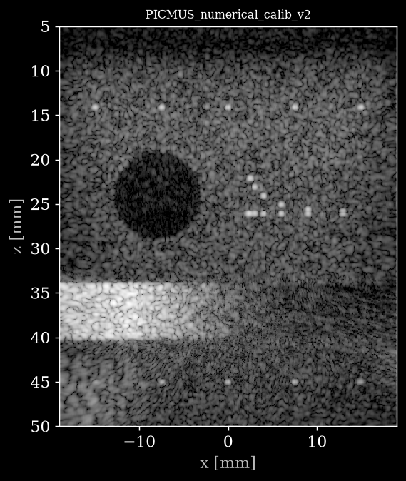

# USTB - Simulation (Field II)



*First frame of [`PICMUS_numerical_calib_v2.hdf5`](https://huggingface.co/datasets/nvidia/OpenH-RF/blob/main/oslo/E_simulation/PICMUS_numerical_calib_v2.hdf5), reconstructed from the raw channel data with `reconstruct.py`.*

## Dataset Description

Part of the **UltraSound ToolBox (USTB) Channel Capture Collection** (see the [collection card](../README.md)).

Physics-based synthetic channel-capture data generated with the Field II ultrasound simulation framework. The collection covers point scatterers, cysts, speckle, dynamic-range targets and blocked-array (aperture-apodized) configurations, using linear (L7-4-like) and phased (P4-like) virtual probes with CPWC, FI and STA sequences. Because the scattering medium is fully defined, exact ground-truth scatterer positions and medium parameters are known. One numerical calibration acquisition (PICMUS_numerical_calib_v2) was created in collaboration with our group as part of the PICMUS effort; it is included here while the other PICMUS datasets are excluded (see Known Issues).

## Dataset Contributor(s)

- Ole Marius Hoel Rindal <omrindal@ifi.uio.no> (primary contact)
- Yucel Karabiyik
- Sven Peter Nasholm
- Andreas Austeng
- University of Oslo (UiO), Department of Informatics

## Dataset Creation Date

06/23/2026 (packaging date; original acquisitions/simulations were produced between 2016 and 2023).

## License / Terms of Use

[Creative Commons Attribution 4.0 International (CC BY 4.0)](https://creativecommons.org/licenses/by/4.0/legalcode.en). Retain attribution and identify modifications when reusing the data.

## Intended Usage

Generalized reconstruction, beamformer development and validation with known ground truth (RFP task 6.1); resolution/contrast/dynamic-range characterization; training/validation of learned reconstruction methods. (OpenH-RF RFP task 6.1 Generalized Reconstruction).

## Dataset Characterization

- **Data Collection Method:** synthetic
- **Labeling Method:** Synthetic ground truth (known scatterer positions and medium parameters).
- **Acquisition system:** probe(s) L7-4, P4-1; element positions stored in `/probe/probe_geometry` (meters); center frequency, sampling frequency and sound speed stored per acquisition in `/scan` (see per-sample feature table).

## Processing the Dataset

The example acquisition can be processed with the `pipeline.yaml` definition in this folder and the [zea library](https://github.com/tue-bmd/zea).

`zea` streams the data from the Hugging Face Hub and processes it according to the pipeline. You can try it out with the following command:

```bash
zea process \
  --dataset hf://nvidia/OpenH-RF/oslo/E_simulation/PICMUS_numerical_calib_v2.hdf5 \
  --config hf://nvidia/OpenH-RF/oslo/E_simulation/pipeline.yaml
```

This `pipeline.yaml` holds the pipeline and display window of that acquisition. Alternatively, all acquisitions can be processed with the `reconstruct.py` [script](https://github.com/open-h/OpenH-RF/blob/main/datasets/oslo/reconstruct.py) at the root of this collection, as provided in the [OpenH-RF GitHub repository](https://github.com/open-h/OpenH-RF), together with the `pipeline*.yaml` definitions at the collection root and the [zea library](https://github.com/tue-bmd/zea). The script streams the data from the Hugging Face Hub; `parameters.yaml` picks the pipeline, display window and dynamic range per acquisition (see the [collection card](../README.md#processing-the-dataset)).

## Dataset Format

[zea v0.1.6](https://github.com/tue-bmd/zea)

All acquisitions are stored in the **zea** HDF5 file format. Each `.hdf5` file is a single acquisition with raw channel data `/data/raw_data` of shape `(n_frames, n_tx, n_ax, n_el, n_ch)` and a fully populated `/scan` group describing the transmit sequence (delays, focus distances, steering angles, apodization, timing). Data type: RF/IQ (n_ch in [1, 2]). No demodulation or decimation was applied during packaging beyond conversion from the USTB Ultrasound File Format (UFF) to zea; RF data is demodulated inside the reconstruction pipeline.

## Dataset Quantification

**Current OpenH-RF release:** 11 HDF5 files; 2.98 GB (2,980,642,816 bytes) stored; root `zea_version` **0.1.6**. Sizes include all HDF5 contents and use decimal units (MB = 10^6 bytes, GB = 10^9 bytes, TB = 10^12 bytes), not decoded-array memory or original-source download sizes.

- **Number of acquisitions:** 11
- **Total channel-capture frames:** 17
- **Train / validation / test split:** not predefined (research dataset).
- **Stored HDF5 size:** 2.98 GB (2,980,642,816 bytes).

Per-acquisition summary:

| Acquisition | frames | transmits | samples | elements | n_ch | fs (MHz) | fc (MHz) | size (MB) |
|---|---|---|---|---|---|---|---|---|
| `FieldII_CPWC_point_scatterers_res_v2` | 7 | 1 | 7792 | 128 | 1 | 100.0 | 5.16 | 2.10 |
| `FieldII_CPWC_simulation_v2` | 1 | 1 | 6494 | 128 | 1 | 100.0 | 5.13 | 0.92 |
| `FieldII_P4_point_scatterers` | 1 | 128 | 14349 | 64 | 1 | 100.0 | 2.56 | 406.13 |
| `FieldII_speckle_DMASsimulation300000pts` | 1 | 96 | 10570 | 128 | 1 | 100.0 | 3.50 | 200.67 |
| `FieldII_STAI_dynamic_range` | 1 | 128 | 7792 | 128 | 1 | 100.0 | 5.13 | 355.40 |
| `FieldII_STAI_simulated_dynamic_range` | 1 | 128 | 7792 | 128 | 1 | 100.0 | 5.13 | 347.60 |
| `FieldII_STAI_uniform_fov` | 1 | 128 | 2771 | 128 | 1 | 25.0 | 5.13 | 125.57 |
| `PICMUS_numerical_calib_v2` | 1 | 5 | 445 | 128 | 2 | 5.2 | 5.21 | 2.16 |
| `speckle_sim_FI_P4_probe_apod_1_speckle_long_many_angles` | 1 | 150 | 15786 | 64 | 1 | 100.0 | 2.56 | 506.40 |
| `speckle_sim_FI_P4_probe_apod_2_speckle_long_many_angles` | 1 | 150 | 15786 | 64 | 1 | 100.0 | 2.56 | 512.49 |
| `speckle_sim_FI_P4_probe_apod_3_speckle_long_many_angles` | 1 | 150 | 15786 | 64 | 1 | 100.0 | 2.56 | 521.21 |

Per-sample feature table:

| Field | Shape | Dtype | Units | Description |
|---|---|---|---|---|
| `data/raw_data` | `(n_frames, n_tx, n_ax, n_el, n_ch)` | float32 | a.u. | Raw pre-beamformed RF channel data |
| `scan/sampling_frequency` | `scalar` | float32 | Hz | A/D sampling frequency |
| `scan/center_frequency` | `scalar` | float32 | Hz | Transmit pulse center frequency |
| `scan/demodulation_frequency` | `scalar` | float32 | Hz | Demodulation (carrier) frequency |
| `scan/sound_speed` | `scalar` | float32 | m/s | Assumed medium speed of sound |
| `scan/initial_times` | `(n_tx,)` | float32 | s | A/D start time per transmit |
| `scan/t0_delays` | `(n_tx, n_el)` | float32 | s | Per-element transmit fire times |
| `scan/tx_apodizations` | `(n_tx, n_el)` | float32 | - | Per-element transmit apodization |
| `scan/focus_distances` | `(n_tx,)` | float32 | m | Focus distance per transmit (0 = plane wave) |
| `scan/polar_angles` | `(n_tx,)` | float32 | rad | Transmit steering (polar) angle |
| `scan/transmit_origins` | `(n_tx, 3)` | float32 | m | Transmit beam origin (x, y, z) |
| `probe/probe_geometry` | `(n_el, 3)` | float32 | m | Element positions (x, y, z) |

## Subject Metadata

No human or animal subjects. Synthetic media simulated with Field II. Virtual probes: L7-4-like linear and P4-like phased arrays.

## Data Validation

A Delay-And-Sum `zea.Pipeline` (`cast -> demodulate -> delay-and-sum beamform -> envelope detect -> normalize -> log compress`; RF is demodulated in-pipeline, IQ uses a baseband pipeline) reconstructs every acquisition as a portable check that the recorded geometry and timing are correct (see *Processing the Dataset*).

The reference B-mode images committed alongside the data (`<name>_bmode.png`) are produced with the UltraSound ToolBox (USTB) MATLAB Delay-And-Sum beamformer — the exact per-dataset reconstruction used in the public USTB dataset catalog (https://unioslo.github.io/USTB/datasets.html), with scanline transmit apodization for focused/sector acquisitions and correct sector-scan geometry. These are the recommended reference reconstructions for visual verification.

## Known Issues

PICMUS calibration: 'PICMUS_numerical_calib_v2' was created in collaboration with our group as part of the PICMUS (Plane-wave Imaging Challenge in Medical UltraSound, IEEE IUS 2016) effort, and is therefore included here. The other PICMUS acquisitions (in-vivo carotid, experimental and simulated resolution/contrast) are deliberately excluded from this submission. Simulation framework: Field II (Jensen et al.).

## Ethical Considerations

Fully synthetic data generated with the Field II simulation framework; no human or animal subjects. No personal data is present. The included numerical calibration file was produced in collaboration with our group as part of the PICMUS effort (IEEE IUS 2016) and is released here under CC BY 4.0.

## Citation

Please cite the UltraSound ToolBox (USTB) Channel Capture Collection, University of Oslo (Zenodo record 20261898).
