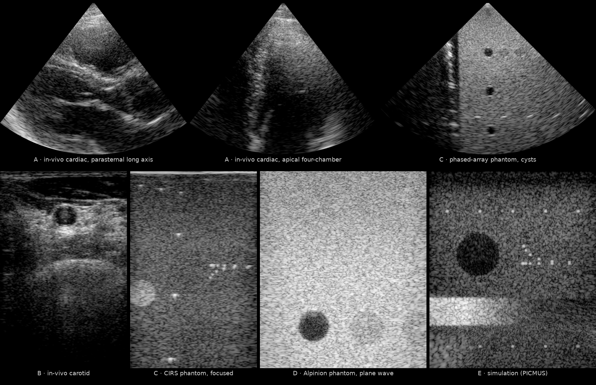

# UltraSound ToolBox (USTB) Channel Capture Collection

*First frames reconstructed from the raw channel data with `reconstruct.py`. Top: [`A_cardiac/Verasonics_P2-4_parasternal_long_subject_1`](https://huggingface.co/datasets/nvidia/OpenH-RF/blob/main/oslo/A_cardiac/Verasonics_P2-4_parasternal_long_subject_1.hdf5), [`A_cardiac/Verasonics_P2-4_apical_four_chamber_subject_1`](https://huggingface.co/datasets/nvidia/OpenH-RF/blob/main/oslo/A_cardiac/Verasonics_P2-4_apical_four_chamber_subject_1.hdf5), [`C_verasonics_phantom/FI_P4_cysts_center`](https://huggingface.co/datasets/nvidia/OpenH-RF/blob/main/oslo/C_verasonics_phantom/FI_P4_cysts_center.hdf5). Bottom: [`B_carotid/L7_FI_carotid_cross_1`](https://huggingface.co/datasets/nvidia/OpenH-RF/blob/main/oslo/B_carotid/L7_FI_carotid_cross_1.hdf5), [`C_verasonics_phantom/L7_FI_Verasonics_CIRS`](https://huggingface.co/datasets/nvidia/OpenH-RF/blob/main/oslo/C_verasonics_phantom/L7_FI_Verasonics_CIRS.hdf5), [`D_alpinion_phantom/Alpinion_L3-8_CPWC_hypoechoic`](https://huggingface.co/datasets/nvidia/OpenH-RF/blob/main/oslo/D_alpinion_phantom/Alpinion_L3-8_CPWC_hypoechoic.hdf5), [`E_simulation/PICMUS_numerical_calib_v2`](https://huggingface.co/datasets/nvidia/OpenH-RF/blob/main/oslo/E_simulation/PICMUS_numerical_calib_v2.hdf5). Panels are scaled to a common height per row, not to a common physical scale.*

## Dataset Description

Contributed by the **University of Oslo (UiO), Department of Informatics** (the USTB team) to the [OpenH-RF](https://github.com/open-h/OpenH-RF) initiative. All data is pre-beamformed (raw channel-capture) ultrasound stored in the **zea** HDF5 format and released under **CC BY 4.0**.

39 acquisitions packaged into six application sub-datasets. Each sub-dataset folder contains its zea `.hdf5` files, a Hugging Face–style `README.md` data card, and one reference B-mode PNG per acquisition. The **`reconstruct.py`, `pipeline.yaml`, and the CC BY 4.0 `LICENCE` live once at the submission root** — the reconstruction reconstructs every sub-dataset (the pipeline is identical across folders), and the single LICENCE covers the whole collection (each data card also declares `license: cc-by-4.0` in its YAML frontmatter).

| Folder | Sub-dataset | Tier | RFP task | Acq. |
|---|---|---|---|---|
| `A_cardiac/` | In-vivo cardiac (Verasonics P4-2) | in-vivo human (research) | 6.1 Generalized Reconstruction | 2 |
| `B_carotid/` | In-vivo carotid (Verasonics L7-4) | in-vivo human (research) | 6.1 Generalized Reconstruction | 3 |
| `C_verasonics_phantom/` | Phantom (Verasonics L7-4 / P4) | phantom | 6.1 Generalized Reconstruction | 15 |
| `D_alpinion_phantom/` | Phantom (Alpinion L3-8) | phantom | 6.1 Generalized Reconstruction | 4 |
| `E_simulation/` | Simulation (Field II) | simulation | 6.1 Generalized Reconstruction | 11 |
| `F_motion/` | Motion estimation (SWE / ARFI, L7-4) | phantom | 6.4 Motion Estimation | 4 |

Total: **39 acquisitions**, 8.61 GB of stored HDF5 data.

## Dataset Contributor(s)

- Ole Marius Hoel Rindal <omrindal@ifi.uio.no> (primary contact)
- Yucel Karabiyik
- Sven Peter Nasholm
- Andreas Austeng
- University of Oslo (UiO), Department of Informatics

## Dataset Creation Date

06/23/2026 (packaging date; original acquisitions/simulations were produced between 2016 and 2023).

## License / Terms of Use

[Creative Commons Attribution 4.0 International (CC BY 4.0)](https://creativecommons.org/licenses/by/4.0/legalcode.en). Retain attribution and identify modifications when reusing the data.

## Processing the Dataset

Every acquisition is reconstructable from the file alone — all acquisition parameters live in the zea `/scan` and `/probe` groups. The acquisitions can be processed with the `reconstruct.py` [script](https://github.com/open-h/OpenH-RF/blob/main/datasets/oslo/reconstruct.py), as provided in the [OpenH-RF GitHub repository](https://github.com/open-h/OpenH-RF), together with the `pipeline*.yaml` and `parameters.yaml` definitions in this folder and the [zea library](https://github.com/tue-bmd/zea). The script streams the data from the Hugging Face Hub: set `PATHS` to the acquisition to reconstruct (default: the apical four-chamber cardiac scan above) and `REFOCUS = True` to also emit the REFoCUS variant. See [Reconstruction Details](#reconstruction-details) for how each acquisition's pipeline is chosen. Each sub-dataset folder also holds a `pipeline.yaml` for its example acquisition, so it can be rendered with a single `zea process` command (see the sub-dataset cards).

## Dataset Format

[zea v0.1.6](https://github.com/tue-bmd/zea)

## Dataset Quantification

**Current OpenH-RF release:** 39 HDF5 files; 8.61 GB (8,613,593,088 bytes) stored; root `zea_version` **0.1.6**. Sizes include all HDF5 contents and use decimal units (MB = 10^6 bytes, GB = 10^9 bytes, TB = 10^12 bytes), not decoded-array memory or original-source download sizes.

## Reconstruction Details

All reconstruction choices live in **`parameters.yaml`** — one entry per acquisition giving its `pipeline` (which `zea.Pipeline` to use), display window (`zlims`/`xlims` in mm) and `dynamic_range`. Every acquisition uses the same workflow (load parameters → run the pipeline → plot); there is no per-file logic in the script. Each `pipeline` value maps to a `zea.Pipeline` YAML at the root:

| `pipeline` | Used for | `zea.Pipeline` |
|---|---|---|
| `scanline` | focused linear (FI) scans | `pipeline_scanline.yaml`: `beamform` on a `grid_type: scanline` grid with `enable_receive_apodization: true` — one focused transmit per image line. The artifact-free reconstruction for a walking-focus linear scan (compounding focused beams onto a shared grid leaves a band at the focal depth). |
| `sector` | phased-array / steered focused sector scans | `pipeline_sector.yaml`: polar grid + scan conversion; pressure-field-weighted DAS with peaked weighting (≈ scanline) and `focal_region_length`. |
| `iq` | baseband IQ (`n_ch == 2`, e.g. PICMUS) | `pipeline_iq.yaml` (no demodulation step). |
| `compound` | non-focused linear (plane-wave / diverging / STA / SWE-ARFI) | `pipeline.yaml`: coherent compounding, no pfield (these insonify the whole field of view). |

The pipelines share the same shape as zea's regular B-mode pipeline (`cast → apply_window → demodulate → beamform → envelope → normalize → log_compress`). Scanline imaging uses the same `beamform` op with a scanline grid plus receive apodization rather than a dedicated scanline-specific operation. Two zea features used in this submission are scanline receive apodization (`enable_receive_apodization`) and `focal_region_length` (focal-region delay blending, Rindal et al., IUS 2018).

An acquisition may also set `refocus: true` in `parameters.yaml`. With `REFOCUS = True` (off by default), `reconstruct.py` additionally runs a REFoCUS reconstruction for those acquisitions — transmit-encoding recovery (Bottenus, 2018) that inverts the transmit-encoding matrix to recover the multistatic (full-matrix-capture) dataset before pressure-field-weighted DAS — and writes a `<name>_zea_refocus_bmode.png` alongside the standard reconstruction. REFoCUS is enabled for **every acquisition with enough encoded transmits for the inversion to be well posed (≥ 8 transmit events)** — coherent plane-wave compounding (CPWC), diverging waves (DW), and focused linear (FI) and phased-array sector scans. Phased-array `sector` acquisitions use `pipeline_refocus_sector.yaml` (polar grid + scan conversion, preserving the sector geometry); every other geometry uses the linear/cartesian `pipeline_refocus.yaml`. REFoCUS is **not** enabled where the inversion is ill-posed or undefined: single/few-transmit acquisitions (the `n_tx = 1` plane-wave tracking sets and single-angle simulations, PICMUS's 5-angle IQ) and synthetic transmit aperture (STA) acquisitions, which are already multistatic.

## Reference images

Each acquisition ships with:
- `<name>_zea_bmode.png` — produced by the root `reconstruct.py` (zea); the reproducible reference.
- `<name>_zea_bmode_old.png` — the initial v2 zea reconstruction (kept for comparison).
- `<name>_bmode.png` — the canonical USTB MATLAB Delay-And-Sum reconstruction from the public [USTB dataset catalog](https://unioslo.github.io/USTB/datasets.html), for cross-validation.
- `<name>_zea_refocus_bmode.png` — REFoCUS variant, for acquisitions with `refocus: true` (CPWC / DW / focused FI / sector with ≥ 8 transmits; not STA or single/few-transmit sets).

## Citation

Please cite the UltraSound ToolBox (USTB) Channel Capture Collection, University of Oslo (Zenodo record 20261898). `PICMUS_numerical_calib_v2` (group E) was created **in collaboration with our group** as part of the PICMUS effort and is included on that basis; the other PICMUS datasets are excluded.
